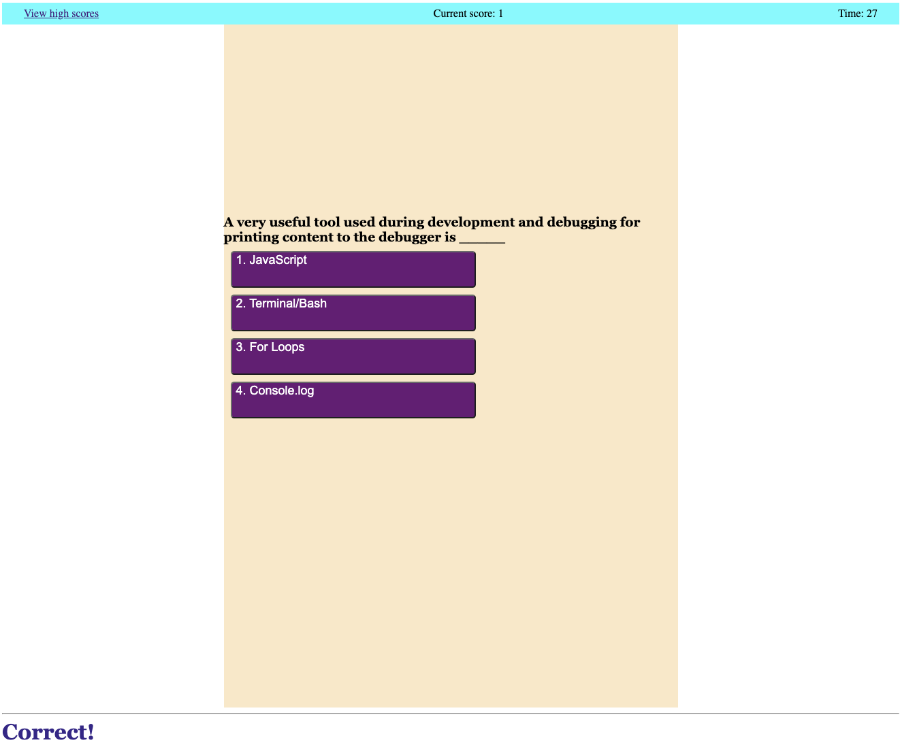

# Coding-Quiz

## Coding Quiz
This project utilized HTML, CSS, and Javascript to generate a quiz to test the user's programming knowledge, specifically those in the Georgia Tech bootcamp. 
 
The header displays a link to go to the leaderboard, the score counter, and the timer. 
 
Once a user clicks the "Start Quiz" button, the timer begins counting down from 75 as they are presented with a series of multiple-choice questions. 
 
If a correct answer is selected, they are awarded 1 point (tracked at the top of the screen), "Correct!" is logged at the bottom of the screen, and the next question is presented. 
 
If they make an incorrect selection, 15 seconds are subtracted from the timer, "Wrong!" is logged at the bottom of the screen, and the next question is presented. 
 
When the timer reaches 0, their final score is presented, and they are given the option to enter their initials. After submitting their initials, they are taken to a leaderboard page. 
 
The leaderboard page should track high scores, as well as present two button options: to return to the home screen, or to clear the leaderboard. 
 
The deployed application can be found here: [link to deployed application](https://okapikid.github.io/Coding-Quiz/)

Here is a screenshot of the project: 
